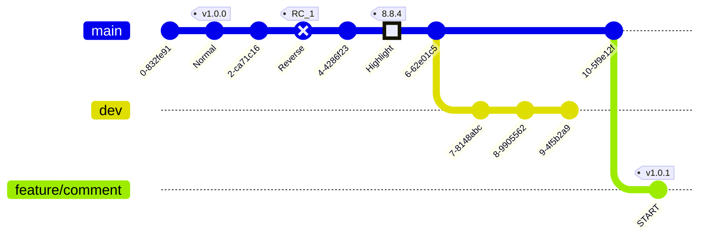

# Sequnce diagram 1


## header2

### header3

[Sequnce diagram doc](https://mermaid.js.org/syntax/sequenceDiagram.html#sequence-diagrams)

- "+" 또는 activate로 시작하고, "-" 또는 deactivate로 끝난다. (중첩 가능)
- --> 점선, ->> 실선 화살표, -->> 점선 화살표 그 외 메시지 기호는 [요기 참고](https://mermaid.js.org/syntax/sequenceDiagram.html#messages)
- par, opt, loop, alt, break 등 지원함

"Dogs" : 386 "Cats" : 85 "Rats" : 14 ```

- par, opt, loop, alt, break 등 지원함




bar

<a href='https://never-visited-site.com'>
  never visited site1 (directry insert a link)
</a>

[never visited site2](https://never-visited-site.com)


# Flow chart 2

[flow chart reference](https://mermaid.js.org/syntax/flowchart.html)

빠르게 의미를 전달하고자 하는 이유로 사용한다면 subgraph나 스타일링을 사용하지 않는게 좋을듯 함


foo


# git graph 4

[Gitgraph Diagrams docs](https://mermaid.js.org/syntax/gitgraph.html)


# last

위 mermaid가잘 출력되는지 체크

```js
;(function Foo() {
  console.log('Foo')
  return 'Foo'
})()
```

asdasd

asdasd

asdasd

asdasd

asdasd

asdasd

asdasd

asdasd

asdasd

asdasd
asdasd

asdasd
asdasd

asdasd
asdasd

asdasd
asdasd

asdasd
asdasd

asdasd

# Foo 한글 어쩌고 띄어쓰기 여러개 추가

ㅎㅎ
