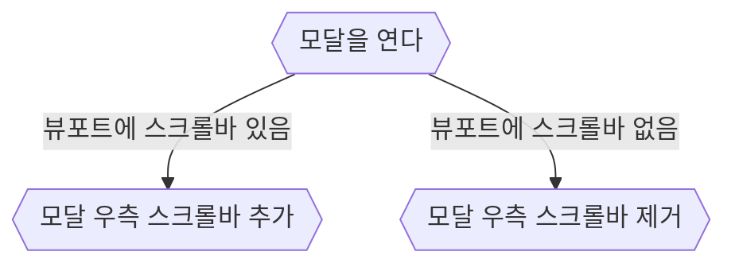

# 탭 (tabindex)

anchor, button, input, select, summary(+ details), textarea는 기본적으로 tab으로 focus를 받을 수 있다.

사용하고자하는 기능이 위 요소의 기능과 동일하다면 위 태그를 사용하는게 베스트이지만, 그렇지 않다면 tabIndex를 사용해야한다.

Breadcumb, Dropbox, Dropdown, Checkbox, Cascader, Switch, ~Picker, ~Tree 등의 이름이 사용되는 컴포넌트라면 tabindex를 점검하자

# 모달 (Modal)

한 페이지 않에서 체계적인 정보를 보여주고 싶을 떄 모달을 사용한다.

브라우저 url 없을 경우 모달로볼 볼 수 있다.

React는 `React.createPortal`, Vue는 `Teleport`를 사용하여 마운트 지점 요소의 형제 요소로 모달을 마운트한다.

html만 사용할 경우 [popover api](https://developer.mozilla.org/ko/docs/Web/API/Popover_API)를 사용해서 모달을 만들 수 있다.

## 컨텐츠 밀림

뷰포트 우측에 스크롤이 있을 경우 모달이 열렸을 때 우측 스크롤 바가 사라지는 경우가 있다.

이때 내부 컨텐츠가 밀리는 현상이 발생한다.

최소한 이런 현상은 발생하지 않아야한다.

상황에 맞게 여러 방법으로 해결할 수 있다.

1. 예외처리를 한다.



2. scrollbar-gutter : stable

[tailwind 공식 사이트](https://tailwindcss.com/)를 보면 algolia 검색 모달을 띄을 때 우측에 하얀 여백이 생기는데

scrollbar-gutter : stable을 사용하여 문제를 해결했다.

3. 별개의 컨텐츠로 분리

position : fixed로 모달 전체를 덮는 커버를 만든다.

## 포커스 (focus)

모달이 열리면 focus가 모달 내부로 이동해야하고

모달이 닫힐 경우 포커스는 모달을 여는 버튼으로 이동해야한다.

`<input autofocus>` 나 `ref.current.focus()`를 사용하여 모달이 열리면 포커스가 이동하도록 한다.

## 키보드 트랩

모달이 띄워지면 모달 내부에서만 탭 이동이 되어야한다.

[useFocusWithin](https://react-spectrum.adobe.com/react-aria/useFocusWithin.html)를 참고해서

`useFoucsWithout`이나 `useFocusBoundary`같은 hook을 직접 만들어 사용한다.

## ESC(Escape) 키

모달이 열려있을 때 ESC 키를 누르면 모달이 닫혀야한다.

```tsx
useEffect(() => {
  document.addEventListener("keydown", handleOnPress)
  return () => {
    document.removeEventListener("keydown", handleOnPress)
  }
}, [])
```

# kbd 태그

`<kbd>`태그는 키보드 입력을 나타낸다.

HTML 문서 표준화와 일관적인 스타일링에 유리하기 때문에 short cut을 나타내는 인터페이스가 있다면 `kdb` 태그를 사용하는 것이 좋다.

## Ctrl + K

브라우저 기본 기능으로 `Ctrl + L`키를 브라우저 주르면 주소창으로 포커스되고 `Ctrl + K`를 누르면 보통 검색창으로 포커스된다.

그리고 Chrom, firefox라면 google 검색으로 포커스되고, Edge라면 Bing 검색으로 포커스된다.

웹 애플리케이션 내에서 검색 기능이 있다면 `Ctrl + K`이벤트를 hooking하여 검색창으로 포커스되도록 한다.

# 줄 바꿈 (white-space, word-break, text-overflow)

사용자에게 전달하고자 하는 목적에 따라서 줄 바꿈을 다르게 처리하자.

샘플 문장 : `터보레포(Turborepo)는 JavaScript 생태계의 패키지 관리자의 기능인 워크스페이스를 기반으로 구축된 빌드 시스템입니다.`

## 정확한 정보를 보여줘야 하는 경우

`word-break : normal` => 기본 줄바꿈, break-all 보단 가독성이 좋다.
`work-break : keep-all` => 단어 단위 줄바꿈  
`word-break : break-all` => 글자(char)단위 줄바꿈, 이건 쓸 일이 거의 없다.

1. `word-break : normal`를 쓸 경우

레이아웃이 꺠지지도 않고, 최대한 적당히 줄바꿈된다.

```css
.text {
  width: 200px;
  word-break: normal;
}
```

```
터보레포(Turborepo)는
JavaScript 생태계의 패키지
관리자의 기능인 워크스페
이스를 기반으로 구축된 빌
드 시스템입니다.
```

2. `word-break : keep-all`를 쓸 경우

단어의 길이가 길 경우 글자가 width를 넘어가서 레이아웃이 깨지기 때문에 때문에 주의해야한다.

**충분한 공간을 확보하고 사용한다.**

```css
.text {
  width: 200px;
  word-break: keep-all;
}
```

```
터보레포(Turborepo)는
JavaScript 생태계의 패키지
관리자의 기능인
워크스페이스를 기반으로
구축된 빌드 시스템입니다.
```

## 정보가 중요하지 않을 경우

1. 한 줄로 표현하기

```css
.text {
  width: 200px;
  text-overflow: ellipsis;
  overflow: hidden;
  white-space: nowrap;
}
```

```
터보레포(Turborepo)는 JavaScript 생태...
```

2. 여러 줄로 표현하기

```css
.text {
  width: 100px;
  word-break: keep-all;
  text-overflow: ellipsis;
  overflow: hidden;
  white-space: normal;
}
```

```
터보레포Tur...
생태계의
패키지
관리자의
기능인
워크스페이...
기반으로
구축된 빌드
시스템입니다.
```
